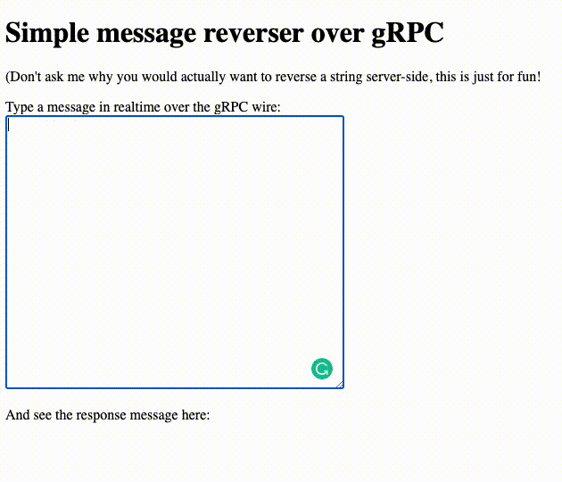

# gRCP with Go, React and TypeScript



A React TypeScript frontend communicating via websocket over a gRPC proxy to a go gRPC server.

This codebase implements mostly what is present on https://github.com/grpc/grpc-web, but takes the protobuf model from: https://grpc.io/docs/languages/go/quickstart/

This is a monorepo, while I don't really like the monorepo concept, it just makes it easy so all the code needed for the example is in one place.

## Step 1: Start up the gRPC Go Server

Start up the gRPC server with the following commands:

```shell
cd grpc-go/src/go-grpc/server
go mod edit -replace go-grpc/utils=../utils
go run main.go
```

You should see something like 

```
2022/05/02 09:52:12 server listening at [::]:50051
```

## Step 2: Start Up the gRPC Proxy

For communication to the gRPC server exposed on port 50051 to be able to communicate with the browser, you need a proxy in between. To start up a go-based proxy, first install it by issuing these commands:

```shell
GOPATH=~/go ; export GOPATH
git clone https://github.com/improbable-eng/grpc-web.git $GOPATH/src/github.com/improbable-eng/grpc-web
cd $GOPATH/src/github.com/improbable-eng/grpc-web
dep ensure # after installing dep
go install ./go/grpcwebproxy # installs into $GOPATH/bin/grpcwebproxy
```

To be compatible with the code in this repository, connecting to the running gRPC server at port 50051 and exposing 8080 to the web, and expose all origins for simplicity, call it with the following:

```shell
GOPATH=~/go ; export GOPATH
$GOPATH/bin/grpcwebproxy \
    --backend_addr=localhost:50051 \
    --run_tls_server=false \
    --use_websockets \
    --allow_all_origins
```

See more options for the go proxy here: https://github.com/improbable-eng/grpc-web/tree/master/go/grpcwebproxy

## Step 3: Start Up the React Application!

First install dependencies:

```
cd react-grpc-test && npm install
```

Then start it up:

```
npm run start
```

## Try It!

If you've followed all three steps, you should have a web app open up in your browser - type into the textarea to see the magic happen! ✨ You should also see logging in both the gRPC proxy and the gRPC server.

## Why WebSocket and not HTTP/2 as Transport Layer?

Until HTTP/2 is better supported in all browsers, it seems that using a WebSocket as the transport layer for browsers may be the best choice. See: https://github.com/improbable-eng/grpc-web/blob/master/client/grpc-web/docs/transport.md#http/2-based-transports

